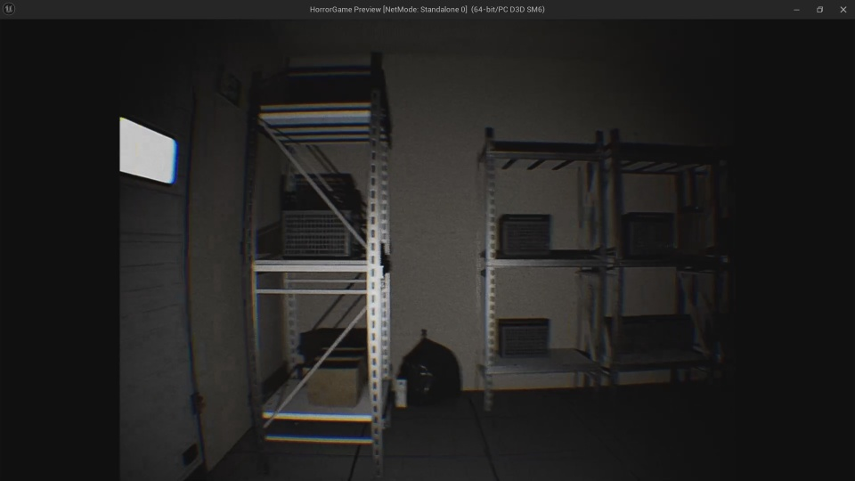
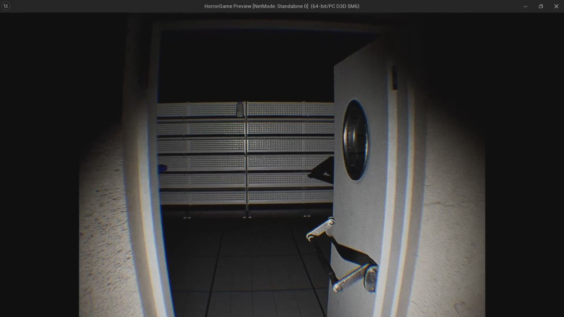
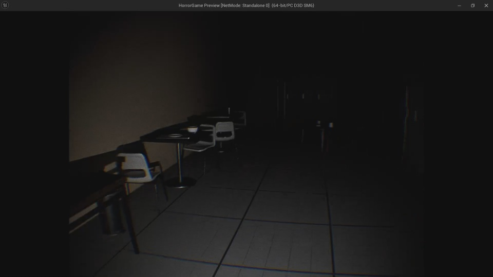

# DreadMart-Horror-FPS

<!---Esses são exemplos. Veja https://shields.io para outras pessoas ou para personalizar este conjunto de escudos. Você pode querer incluir dependências, status do projeto e informações de licença aqui--->

YOUTUBE VIDEO:
(https://www.youtube.com/watch?v=h51Y9w1-Zhw)

> DreadMart is an horror experience made with UnrealEngine 5

## 💻 Requirements

Before starting, make sure you've met the following requirements:
* UnrealEngine 5

## 📝 License

This project is under license. See the [LICENSE](CC-BY-4.0) file for more details.
